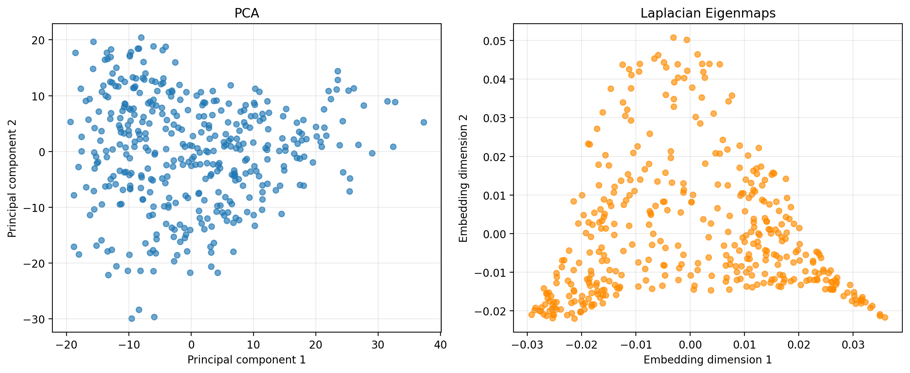

# Pattern Recognition: Text Embeddings and Medical Images

This repository presents two pattern-recognition case studies completed for FYS-3012 at UiT The Arctic University of Norway.

1. **Movie-review exploration:** reduce 1,024-dimensional BERT embeddings to two dimensions with PCA and Laplacian Eigenmaps, then inspect whether sentiment structure is visible.
2. **Mammogram classification:** compare a least-squares classifier, a polynomial support vector machine (SVM), and a small neural network on BreastMNIST.

The portfolio version cleans and corrects the original coursework implementation. In particular, PCA projects the samples rather than the covariance matrix, Laplacian Eigenmaps uses a true nearest-neighbour graph, and the SVM is implemented as a classifier rather than a regressor.

## What I learned

Dimensionality reduction can reveal broad structure in high-dimensional language embeddings, but a two-dimensional representation loses semantic detail. This was especially visible for sarcasm and mixed-sentiment reviews. For the medical-image task, the original experiment suggested that the SVM generalized better than the neural network on a small dataset. It also showed why accuracy alone is not sufficient in a medical setting: recall for malignant cases is particularly important because false negatives are costly.

## Repository structure

```text
src/sentiment_embeddings.py       PCA and Laplacian Eigenmaps
src/mammogram_classification.py   Least squares, SVM and neural network
results/                          Generated figures and metric tables
data/README.md                    Instructions for adding the supplied data
```

## Setup

```bash
python -m venv .venv
python -m pip install -r requirements.txt
```

Place the data files in `data/` as described in [data/README.md](data/README.md), then run:

```bash
python src/sentiment_embeddings.py
python src/mammogram_classification.py
```

## Original coursework results

The submitted experiment reported the following test accuracies. These numbers are retained for transparency and should not be interpreted as clinical performance.

| Model | Test accuracy |
|---|---:|
| Polynomial SVM | 0.7564 |
| Neural network | 0.7308 |
| Least-squares classifier | 0.4487 |

The cleaned scripts additionally report precision, recall, F1 score, and confusion matrices. Results can vary slightly with software versions, but fixed random seeds are used where possible.

### Results from the corrected portfolio implementation

| Model | Accuracy | Malignant recall | Malignant F1 |
|---|---:|---:|---:|
| Neural network | 0.8077 | 0.9474 | 0.8780 |
| Polynomial SVM | 0.7756 | 0.9737 | 0.8638 |
| Least squares | 0.7051 | 0.7368 | 0.7850 |

The SVM detected 111 of 114 malignant cases, giving it the highest malignant-case recall. The neural network had the highest overall accuracy and F1 score. In a real screening setting, the acceptable trade-off between missed malignant cases and unnecessary follow-up examinations would need to be determined with clinicians.



## Limitations

- The sentiment prototype uses only 20 manually labelled reviews, so it is exploratory rather than a reliable sentiment system.
- Reducing BERT embeddings to two dimensions discards information and can obscure sarcasm, neutrality, and mixed sentiment.
- BreastMNIST is small and low resolution. These models are educational baselines and are not suitable for clinical use.
- A fair medical comparison requires careful hyperparameter selection using validation data and only one final evaluation on the test set.

## Data and attribution

The course-provided datasets and exam document are not redistributed in this repository. BreastMNIST is part of [MedMNIST](https://medmnist.com/). See `data/README.md` for expected filenames.

## Author

Grace Nori Gani — Applied Physics and Mathematics student at UiT, specializing in Earth observation.
